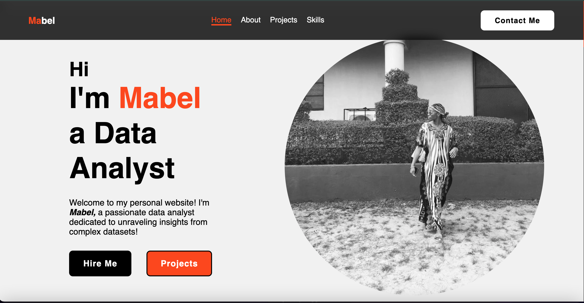

## About Me

I am Mabel Dagogo, a final year Computer Science student at Abia State University, currently undergoing a six-month internship program with Cloud10 Tech Hub Limited. Throughout this internship, I have had the privilege of acquiring valuable skills and knowledge in the field of data analytics, under the expert guidance of Mr. Benson Abraham, my dedicated tutor and mentor.

## Skills Acquired

During my internship with Cloud10 Tech Hub Limited, I have immersed myself in various aspects of data analytics, honing my proficiency in essential tools and technologies. Some of the key skills I have acquired include:

- **Python:** Leveraging Python for data manipulation, analysis, and visualization.
- **Tableau:** Harnessing Tableau for interactive data visualization and dashboard creation.
- **SQL:** Utilizing SQL for database management, querying, and data retrieval.
- **Excel:** Mastering advanced Excel functionalities for data analysis and reporting.
- **HTML & CSS:** Developing foundational web development skills for data presentation and visualization.

## The Capstone Project

As part of the requirements for completing my internship program, I embarked on a personal portfolio project aimed at showcasing the skills and knowledge acquired during my tenure at Cloud10 Tech Hub Limited. This project serves as a testament to my dedication, competence, and passion for data analytics.

## Purpose of the Project

The personal portfolio project serves multiple purposes, including:

- **Showcasing Learning:** It provides a comprehensive overview of the skills and expertise I have developed throughout my internship, allowing prospective employers and clients to assess my capabilities at a glance.
- **Enhancing Visibility:** By making myself visible through this portfolio, I aim to attract opportunities for career advancement and professional growth in the field of data analytics.
- **Reinforcing Skills:** The project serves as a platform to reinforce and apply the skills and knowledge acquired during the internship, ensuring their practical application and relevance in real-world scenarios.
- **Reference and Documentation:** Additionally, the portfolio project serves as a reference tool for future endeavors, allowing me to track my progress and achievements in the field of data analytics.

## Acknowledgments

I extend my sincere appreciation to Mr. Benson Abraham, my esteemed tutor and mentor at Cloud10 Tech Hub Limited, for his unwavering support, guidance, and dedication to my professional development. I am also grateful to Abia State University for providing me with the opportunity to participate in the internship program and for fostering an environment conducive to learning and growth.

Lastly, I express my heartfelt gratitude to my parents for their unconditional love, encouragement, and unwavering support throughout my educational journey. Their belief in my abilities and sacrifices have been the driving force behind my pursuit of excellence.

## Contact Information

For inquiries or further information, please feel free to contact me:

- **Email:** jumbomabel512@gmail.com
- **Phone:** +2349020196413

## Copyright

© 2024 Mabel Dagogo. All Rights Reserved.

